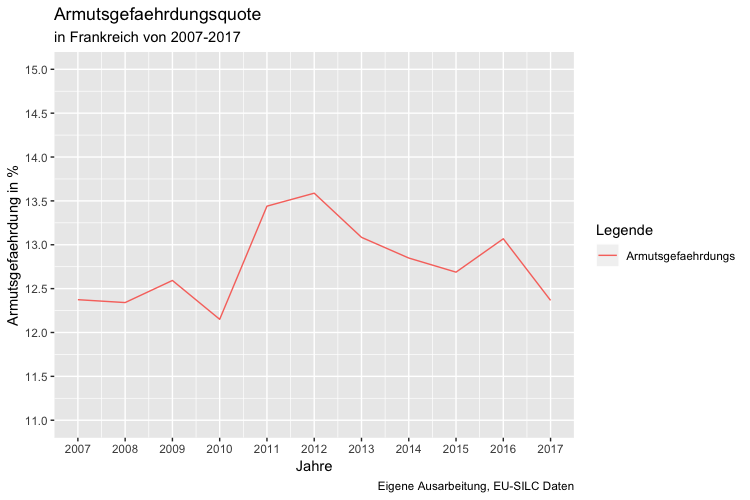
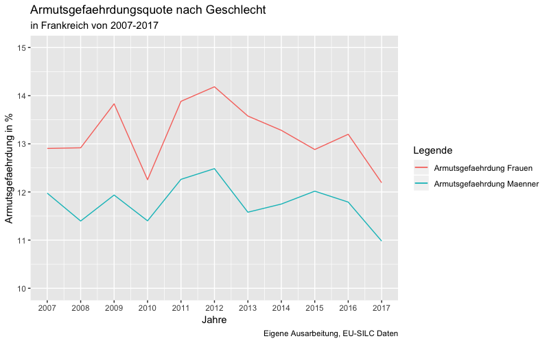

```{r setup, include=FALSE}
knitr::opts_chunk$set(echo = TRUE)
```

\newpage

# Rmarkdown Demonstration

```{r, include=FALSE}
cat("Ausgeführt, nichts angezeigt")
```

```{r, eval=FALSE}
cat("Nicht ausgeführt, angezeigt")
```

```{r echo=FALSE}
cat("Ausgeführt, Output angezeigt")
```

```{r}
cat("Ausgeführt, alles angezeigt")
```

<!-- Kommentare im Dokument -->

Text *kursiv* und **fett**.

R-Code im Text: `r pi`

LaTeX Formeln inline: ($e = mc^2$) und:

$$\hat{\beta} = (X'X)^{-1}X'Y$$

{width=60%}

[Links einfügen (Bildquelle)](https://what-if.xkcd.com/118/)

Zitieren aus *BibTeX*:

- [@marmot2010fair; @lancee2012income]
- [@humer2013bedeutung, p. 571]
- @humer2013bedeutung

Block-Zitate:

> "Don't quote me on that."

Ungeordnete Listen:

- Einkommen
- Kapital

Geordnete Listen:

1. Zahlen
3. sind
9. egal

Simple Tabellen:
<!-- Leerzeichen sind egal -->

|Country  | Gini  | Theil | QSR |
| ---     | ---   | ---   | --- |
| AUT     | 0.28  | 0.5   | NA  |

R-Plots:

```{r fig-rnorm, echo=FALSE, fig.cap="Inklusive Optionen", fig.width=4}
plot(rnorm(50), rnorm(50))
```

Potentiell weniger simple Tabellen:

```{r echo=FALSE, }
# Read CSV data, "../../" to look two levels upwards
table <- read.csv("tables/_template-table.csv")
knitr::kable(table, caption = "Mit Optionen")
```

Horizontale Linien:

---

\newpage

# Einführung

## Einkommensverteilung in Frankreich

|Country  | Gini  | Top 10| QSR |
| ---     | ---   | ---   | --- |
| FR      | 0.28  | 0.5   | NA  |


## Armutsentwicklung in Frankreich
# ADD: Verbindung Armut und Einkommensungleichheit
Mitte September 2018 verkündete der französische Präsident Emmanuel Macron Frankreichs Strategie gegen Armut. Acht Milliarden Euro sollen zur Verfügung gestellt werden, um Ungleichheiten zu verringern und die Armut innerhalb Frankreichs zu senken. Besonderer Fokus liegt dabei auf der Förderung von jungen Menschen, deren Ausbildung von früh an unterstützt werden soll. Der französische Präsident ist mehrfach unter Kritik geraten, mit seinen politischen Maßnahmen die reichere Bevölkerungsschicht zu übervorteilen, wie zum Beispiel durch die weitgehende Abschaffung der Vermögenssteuer. [@povertystrategy2018financial]

Die Verringerung von Armut und sozialer Ausgrenzung gehört als wichtiger Parameter zur Strategie Europa 2020, die es zum Ziel hat Beschäftigung und Wachstum in der EU bis zum Ende dieses Jahrzehnts zu fördern. Für die fünf Bereiche Armut, Forschung und Entwicklung, Klimawandel und Energie, Beschäftigung und Bildung wurden Zielvorgaben entwickelt, die über die Laufzeit gemessen und überprüft werden. Bezüglich Armut und sozialer Ausgrenzung wurde eine Verringerung von zumindest 20 Millionen betroffenen Menschen anvisiert. [@europkommission]

Der Grund dafür ist, dass laut der Europäischen Kommission im Jahr 2016 23,5% der Bevölkerung der Europäischen Union und somit beinahe jede vierte Person von Armut und sozialer Ausgrenzung in der EU bedroht war. Dabei wird Armut und soziale Ausgrenzung nicht nur monetär, sondern als ein multi-dimensionales Konstrukt beschrieben. Es werden im Besonderen drei verschiedene Formen beschrieben, die neben monetärer Armut, gemessen als Armutsgefährdungsquote, auch noch den Grad der materiellen Deprivation sowie die Arbeitsintensität des Haushalts umfassen. Innerhalb der EU kommt die monetäre Armut im Jahr 2016 am häufigsten vor und betrifft 17,3% der Bevölkerung der Europäischen Union. Erhebliche materielle Deprivation dahingegend erfährt nur ein geringerer Anteil von 7,5%, und 10,5% weisen eine niedrige Arbeitsintensität auf. Die Quote der materiellen Deprivation ist verglichen zur Armutsgefährdungsquote und der niedrigen Arbeitsintensität EU-weit gefallen, und weist somit die größte Veränderung auf. Seit dem Jahr 2010 ist der Anteil der niedrigen Arbeitsintensität auf einem relativ konstanten Level geblieben. Dieser umfasst Personen, die im Alter von 0 bis 59 Jahre eine geringere Arbeitsintensität aufweisen. Eine Vollzeit Anstellung zu haben heißt jedoch nicht in jedem Fall, von Armut und sozialer Ausgrenzung verschont zu bleiben: Innerhalb der EU galten 2016 7,8%  trotz Vollzeitbeschäftigung als armutgefährdet. Im Vergleich zur OECD und somit anderen Industriestaaten, ist die monetäre Armut im Durchschnitt in den EU-Länder mit 17,3% relativ gering, während sich dieser Wert auf OECD-Ebene zwischen 20% und 25% bewegt. [@Eurostatindicator]

# Literaturüberblick
Die längste Betrachtung der Einkommensverteilung in Frankreich wird über den Zeitraum, von 1900-2014, mithilfe von Daten der Distributional National Accounts (DINA), welche National Accounts, Steuer- und  Umfragedaten vereint, von Garbinti, Goupille-Lebret und Piketty (2018) vorgenommen. Zu den relevanten Ergebnissen, welche die aktuelle Veränderung der Einkommensverteilung betrifft, gehört der relativ starke Anstieg der Top Einkommen seit den 1980er Jahren. Von 1983-2014 zeigt sich sowohl bei dem Arbeits- als auch dem Kapitaleinkommen ab dem 95. Perzentil ein  relativ starker  Anstieg,  der  bei  den  Top  1%  und  0,1%  am  größten  ist. Garbinti, Goupille-Lebret und Piketty (2018) zeigen auf, dass der Anteil am Gesamteinkommen der Top 1% von 1983 bis 2007 um mehr als 50% gestiegen ist, nämlich von weniger als 8% auf mehr als 12%. Während und nach der Wirtschafts- und Finanzkrise, zwischen 2008 und 2013, sinkt der Einkommensanteil der Top 10%, verbleibt jedoch auf einem höheren Niveau als zu Beginn der 1980er Jahre. Außerdem analysieren die Autoren die Entwicklung des Gender Pay Gap und kommen für das Jahr 2012 zu folgendem Ergebnis: Die Lohnunterschiede steigen mit zunehmendem Alter an. Mit 25 Jahren verdient ein Mann im Durchschnitt das 1.25-Fache von einer Frau. Im Alter von 65 Jahren, hat sich der Lohnunterschied deutlich vergrößert, da im Durchschnitt das Einkommen eines Mannes bei dem 1.64 fachen einer Frau liegt. Geschlechtspezifische Lohnunterschiede bleiben somit groß, auch wenn diese in den letzten Jahrzehnten signifikant gesunken sind. [@Piketty2018]

Eine Erklärung für den Anstieg der Top Einkommen bis 2007 bietet der Bericht des Institutes for Public Policy (2014), welcher untersucht wie sich die Einkommenssteuer über hundert Jahre hinweg in Frankreich entwickelt hat. Seit 1987 haben sich mehrere Änderungen gezeigt: Bis 1986 gab es in Frankreich 14 verschiedene Einkommenssteuertarife, die sich auf 7 zwischen 1994 und 2006 und auf 6 ab 2013 reduziert haben. Die Folge davon war, dass sich auch der Grenzsteuersatzan der Spitze verringert hat: Zwischen 1994 und 2006 betrug er noch 56,8% und sunk im Jahr 2007 auf 40% ab. [@publicpolicy] Zu dem selben Schluss kommen auch XX, die neben der Reduktion der Steuersätze auch die Abnahme des Einflusses von Gewerkschaften und Tarifverhandlungen, sowie die Rolle der Institutionen als Gründe für den Anstieg der Top Einkommen in Frankreich nennen.
[@Piketty2014]


Der Bericht der staatlichen französischen Statistikbehörde INSEE, der jedes Jahr erscheint und die Entwicklungen der Einkommens- und Vermögensverteilung zusammenfasst, kommt zum Ergebnis, dass Einkommensungleichheiten von 2008 bis 2015 auf einem relativen stabilen Level geblieben sind. Der Gini Koeffizient ist in dem Zeitraum leicht angestiegen, von 0,289 auf 0,292, sowie die 80/20 Ratio die von 4,3 auf 4,4. Die Publikation der staatlichen französischen Statistikbehörde basiert jedoch auf nationalen Daten, die nicht auf EU-Ebene harmonisiert sind, wie die EU-SILC Daten. [@INSEE]

Der Bericht der staatlichen französischen Statistikbehörde INSEE, der jährlich erscheint und die Entwicklungen der Einkommens- und Vermögensverteilung zusammenfasst, kommt zum Ergebnis, dass Einkommensungleichheiten von 2008 bis 2015 auf einem relativen stabilen Level geblieben sind. Der Gini-Koeffizient ist in dem Zeitraum leicht angestiegen, von 0,289 auf 0,292. Auch das S80/S20 Einkommensquintilverhältnis von 4,3 auf 4,4 gestiegen. Die Publikation der staatlichen französischen Statistikbehörde basiert jedoch auf nationalen Daten,die nicht, wie die EU-SILC Daten, auf EU-Ebene harmonisiert sind.


# Methodologie

## Daten
Um die Einkommensungleichheit und die Entwicklung von Armut in Frankreich im Zeitverlauf sichtbar zu machen, werden die Daten der EU-SILC (European Union Statistics on Income and Living Conditions) analysiert. Die Daten werden durch standardisierte jährliche Erhebungen innerhalb der EU zum Thema Einkommen und Lebensbedingungen erhoben, wodurch die Daten EU-weit vergleichbar sind. Dabei werden ausschließlich Personen befragt, die in Privathaushalten leben. Da der Schwerpunkt auf Einkommen liegt und detaillierte Daten vorhanden sind, bietet sich die Beurteilung der Einkommensverteilung und sozialen Eingliederung in Frankreich durch EU-SILC Daten an.[@EurostatEUSILC]

Trotz der EU-weiten Harmonisierung der Datenerhebung treten weiterhin länderspezifischen Unterschiede auf. So wird etwa das Sacheinkommen durch die Bereitstellung von Dienstwägen grundsätzlich separat erhoben und folglich separat in die Einkommensaggregate eingerechnet. In Frankreich ist dies aus technischen Gtünden allerdings nicht möglich, sodass etwaige Sacheinkommen durch Dienstwägen bereits in der Variable des Bruttojahreseinkommen (PY010G) enthalten ist. Dies soll im Sinne der Nachvollziehbarkeit erwähnt werden, hat auf die vorliegende Analyse jedoch keine Auswirkungen. [@EurostatQualityReport]

Problematischer gestalten sich Zeitreihenumbrüche in den Datensätzen, xxx Definitionen ändern sich uim Zeitverlauf, im Rahmen der verfügbaren Daten vermieden -- überhaupt erwähnen, weil wir nicht genau wissen, wo es hakt? xxx


## Konzepte

Zur Analyse der Einkommensverteilung in Frankreich werden drei verschiedene Einkommensaggregate herangezogen, die nun näher erläutert werden. Das Faktoreinkommen vor Steuern entspricht der Summe aller Erwerbs- und Kapitaleinkommen eines Jahres. Dieses Konzept klammert also das Steuer- und Sozialversicherungssystem eines Landes aus, was nützlich sein kann, um etwa die Verteilung von Löhnen innerhalb der Erwerbsbevölkerung zu begutachten. 
Problematisch am Faktoreinkommen ist jedoch, dass pensionierte Personen typischerweise über ein sehr kleines bzw. über gar kein Faktoreinkommen verfügen. Steigt also der Anteil älterer Personen an der Gesamtbevölkerung eines Landes, werden dessen Ungleichheitsmaße auf Basis des Faktoreinkommens automatisch größer. Dieser Umstand kann Vergleiche über Jahre bzw. Staaten hinweg verzerren. [@Piketty2018]

Das Nationaleinkommen vor Steuern entspricht dem Faktoreinkommen zuzüglich Arbeitslosenbezüge und Pensionszahlungen. Andere Transfer- und Steuerzahlungen bleiben aber weiterhin unberücksichtigt. Durch das Einbeziehen von arbeitsbezogenen Transfers wird die beim Faktoreinkommen auftretende Verzerrung durch veränderte Altersstrukturen umgangen. Allerdings wird das Nationaleinkommen vor Steuern naturgemäß durch Reformen im Bereich der Arbeitslosen- und Pensionsversicherung verzerrt. Das kann aber durchaus einen gewünschten Effekt darstellen und durch einen Vergleich mit dem Faktoreinkommen vor Steuern erkenntlich gemacht werden.

Das verfügbare Einkommen nach Steuern entspricht dem Nationaleinkommen vor Steuern, zuzüglich aller weiteren monetären Transfers und abzüglich aller direkten Steuern. Dieses Konzept ist von allen drei vorgestellten Aggregaten zur Messung der Armutsgefährdungsquote am besten geeignet, da insbesondere Personen am unteren Ende der Einkommensverteilung auf staatliche Transfers angewiesen sind, die im Zuge der beiden Vorsteuer-Aggregate nicht vollständig berücksichtigt werden. Die Verteilung des verfügbaren Einkommens wird daher im Fokus dieser Arbeit stehen. Wertvolle Einblicke kann zudem eine Gegenüberstellung des verfügbaren Einkommens mit den Vorsteuer-Aggregaten liefern, da sie das Ausmaß der Umverteilung durch den Staat wiedergibt.

Da einige Einkommensdaten wie etwa xxxx nur auf Haushaltsebene verfügbar sind, müssen zudem Annahmen zur Aufspaltung von Haushalts- in Personeneinkommen getroffen werden. Hierfür werden zwei Konzepte angewandt: In Anlehnung an Eurostat werden alle befragten Personen jeden Alters in das Sample aufgenommen. Dann werden alle Einkommen eines Haushalts addiert und gleichmäßig auf die äquivalenten Haushaltsmitglieder aufgeteilt. Es wird also angenommen, dass alle Haushaltsmitglieder in gleichem Maße vom Haushaltseinkommen zehren. Zudem impliziert der herangezogene Äquivalenzschlüssel, dass Haushalte gewisse Größenvorteile haben. [@Eurostatmethod]

Als zweites Konzept werden in Anlehnung an die World Inequality Database bloß Personen ab einem Alter von 20 Jahren in das Sample aufgenommen. Dann wird nicht das gesamte Haushaltseinkommen gepoolt, sondern bloß jener Anteil, der ausschließlich auf Haushaltsebene verfügbar ist (…). Dieser Anteil wird dann auf die reale Anzahl an Haushaltsmitgliedern aufgeteilt und zum persönlichen Einkommen (…) hinzugezählt. Es werden also keine Größenvorteile von Haushalten impliziert. Zudem handelt es sich um ein individualistisches Einkommenskonzept, das auf der Annahme basiert, dass etwa eine nicht erwerbstätige Frau in einem geringeren Ausmaß vom Gehalt ihres Mannes profitiert als dieser selbst. Angesichts der niedrigeren Erwerbsquote von Frauen und des Gender Wage Gap kann diese Methode also zum Beispiel zur Analyse von Geschlechterunterschieden nützlich sein. Allerdings wird durch das restriktivere Sample die finanzielle Belastung durch im Haushalt lebende Kinder vollständig ausgeklammert.

Abschließend soll angemerkt werden, dass im Zuge der Datenaufbereitung alle Personen, die ein Einkommen von null Euro oder ein negatives Einkommen in einer der drei Einkommenskonzepte aufweisen, vor der Berechnung aller Indikatoren aus dem Sample genommen werden. Damit wird gewährleistet

dadurch werden alle Personen, die kein Faktoreinkommen haben, aus dem Sample genommen - auch für die Analysen auf Basis des Nationaleinkommens vor Steuern und des verfügbaren Einkommens. bla

### Einkommensverteilung in Frankreich

allgemeine Einführung, unterschiedliche Konzepte erklären, Fokus auf verfügbarem Äquivalenzeinkommen, da dieses für die Armutsentwicklung am aussagekräftigsten ist

#### Median und Mittelwert

xxx Median und Mittelwert erklären

Die Zeitreihen für das Median- und Mittelwerteinkommen wurden mit dem Verbraucherpreisindex der Eurostat bereinigt. Dadurch wurden alle Einkommen in das Preisniveau von 2015 konvertiert. 
Klar ersichtlich ist, dass sowohl das Durchschnitts- als auch das Medianeinkommen in Frankreich von 2004 bis 2017 angestiegen ist. So stieg das mittlere Jahreseinkommen eines äqivalenten Haushaltsmitglieds von 2004 bis 2016 von rund 18.550€ auf 22.020€ an. Das Durchschnittseinkommen stieg noch stärker an und liegt zudem deutlich über dem Medianeinkommen, was für eine rechtsschiefe Einkommensverteilung spricht. (prüfen, ob relativer Gap zwischen Mean und Median gewachsen)

Auffallend ist zudem, dass das Medianeinkommen von 2009 bis 2012 fiel, während in den verbleibenden Perioden stets ein Zuwachs zu verzeichnen war. Diese Einbußen stehen mit der Wirtschafts- und Finanzkrise 2008 in Verbindung, im Schatten derer Frankreich in die Rezession rutschte: Innerhalb von zwei Jahren brach das reale BIP-Wachstum um mehr als 5 Prozentpunkte ein (von plus 2,34% in 2007 auf minus 2.9% in 2009) Dies wirkte sich auf die Einkommen privater Haushalte negativ aus. [@EurostatGDP]


#### Gini-Koeffizient

Der Gini Koeffizient gehört zu den Standardindikatoren zur Messung der Einkommensungleichheit. Der Indikator kann Werte zwischen 0 und 1 einnehmen, wobei 0 eine vollkommen gleiche und 1 eine vollkommen ungleiche Verteilung des Einkommens beschreibt. Je höher der Wert


#### S80/S20


#### Anteil der Top 10%

Dieser Einkommensindikator beschreibt jenen Anteil, den die reichsten 10% der französischen Bevölkerung, gemessen am Gesamteinkommen verdienen. Um den Anteil der Top 10% darzustellen, werden die drei verschiedenen Einkommenskonzepte verwendet: das Faktoreinkommen, Nationaleinkommen (beide vor Steuern) und das verfügbare Einkommen (nach Steuern). Das gesamte Einkommen wird innerhalb eines Haushalts über alle Mitglieder gleich verteilt. Über den gesamten Betrachtungszeitraum zeigt sich ein Anstieg des Anteils der Top 10%, unabhängig vom Einkommenskonzept und das Faktoreinkommen weist durchgehend den höchsten Wert auf. Der höchste Zuwachs wird zu Beginn der Periode, im Besonderen im Jahr 2007 verzeichnet. Seit den 1980er Jahren wurden in Frankreich mehrfach Steuerreformen durchgeführt, welche die 14 Tarifstufen auf 7 reduziert haben. Dazu zählt jene die den höchste Steuersatz im Jahr 2006 auf 48,09% und 2007 auf 40% herabgesetzt hat. 

Dieser Einkommensindikator beschreibt jenen Anteil, den die reichsten 10% der französischen Bevölkerung, gemessen am Gesamteinkommen verdient. Um den Anteil der Top 10% darzustellen, werden die drei verschiedenen Einkommenskonzepte verwendet: das Faktoreinkommen, Nationaleinkommen (beide vor Steuern) und das verfügbare Einkommen (nach Steuern). Über den gesamten Betrachtungszeitraum zeigt sich ein Anstieg des Anteils der Top 10%, unabhängig vom Einkommenskonzept. Das Faktoreinkommen weist dahin durchgehend den höchsten Wert auf. 

{width=90%}

[@Piketty2014]
vom Garbinti-Paper:

This sharp rise of very top incomes since the 1980s is due both to top capital incomes and top labour incomes. Regarding the rise of top capital incomes, one should distinguish between two effects: 
the rise of the macroeconomic capital share on the one hand (an evolution that is due to a combination of economic and institutional factors, including the decline of labour bargaining power and the lift of rent control, and that was reinforced by corporate privatization policies); and 
the rise of wealth concentration on the other hand.

Regarding the rise of top labour incomes, it is worth stressing that it occurred only at the very top (i.e. above the 95th percentile) and mostly within the top 1% and top 0.1%. It is difficult for standard explanations based upon technical change and changing supply and demand of skills to fully explain this concentration of rising inequality at the very top. It seems more promising to stress the role of institutional factors governing pay setting processes for top managerial compensation, including corporate governance, the decline of unions and collective bargaining processes, and the drop in top income tax rates (see Piketty et al. 2014).


### Armutsentwicklung in Frankreich
Um das Ausmaß und die Entwicklung der Armut und sozialen Ausgrenzung innerhalb von Frankreich zu beurteilen, werden die drei folgenden Hauptindikatoren verwendet: die Armutsgefährdungsquote, die Quote der materiellen Deprivation und die Rate der in Haushalten mit niedriger Erwerbsintensität lebenden Personen. Dabei wird im Folgenden eine Zeitreihenanalyse beginnend im Jahr 2004 bis 2017 durchgeführt und die Entwicklung sowie etwaige Veränderungen erforscht. Diese Messgrößen stellen jedoch nicht den Anspruch, die Armutsschichten in Frankreich vollständig darzustellen, da dafür eine umfangreichere Analyse notwendig wäre. Dennoch stellen die drei Indikatoren, die unterschiedliche Formen und Aspekte von Armut festhalten, in Kombination eine vernünftige Grundlage zur Beurteilung dar und gelten zu den EU Sozialindikatoren, anhand von welchen die Erreichung der Strategie Europa 2020 betreffend Armut und sozialer Ausgrenzung gemessen wird.

Die Armutsgefährdungsquote beschreibt den Anteil der Personen, die aufgrund ihres relativ geringen Einkommens von Armut und sozialer Ausgrenzung bedroht sind. Der Indikator stellt ein monetäres und relatives Maß zur Messung von Armut dar und weist häufig, aber nicht zwingend, auf einen niedrigen Lebensstandard hin. Die Messgröße für die Armutsgefährdungsquote ist das verfügbare Äquivalenzeinkommen einer Person. Dies entspricht jenem Einkommen des Haushaltseinkommens (nach Steuern und anderen Abgaben), welches durch die einzelnen Haushaltsmitglieder aufgeteilt und gewichtet wird, und somit jeder einzelnen Person des Haushalts zur Verfügung steht. Sobald das Äquivalenzeinkommen den Schwellenwert, der üblicherweise mit 60% des Medianeinkommens festgesetzt ist, unterschreitet, wird Armutsgefährdung vermutet. Die Armutsgefährdungsquote ist somit der Anteil der Personen, deren verfügbares Äquivalenzeinkommen weniger als 60% des nationalen mittleren Einkommens ausmacht. [@Eurostatriskpoverty] Somit drückt die Armutsgefährdungsquote nur das Ausmaß der Armut aus, aber nicht die Intensität, da nicht berücksichtigt wird, wie weit die jeweilige Personen vom Schwellenwert entfernt ist. Veränderungen wie etwa steigende Lebenserhaltungskosten werden bei der Berechnung der Armutsgefährdungsquote im Zeitverlauf nicht berücksichtigt. 


In Frankreich gelten 12,3% der Bevölkerung laut der Armutsgefährdungsquote als armutsgefährdet. Dies entspricht dem gleichen Anteil der Bevölkerung wie zu Beginn des Betrachtungszeitraumes. Die Armutsgefährdungsquote umfasst alle Personen der Bevölkerung Frankreichs, die in Privathaushalten leben. Die Armutsgefährdungsquote zeigt über den Beobachtungszeitraum relative Konstanz und weist als die bemerkenswerteste Veränderung den Anstieg zwischen 2010 und 2012 von rund 1,3% auf. Im Jahr 2012 wird der höchste Wert der Armutsgefährdungsquote von etwa 13,6% erreicht, welcher dann wieder auf 12,6% im Jahr 2015 absinkt. Der Anstieg der Armutsgefährdungsquote geht laut der staatlichen französischen Statistikbehörde auf die Wirtschafts- und Finanzkrise 2008/2009 zurück und sinkt seitdem wieder ab.


{width=90%}

Die Aufspaltung der Armutsgefährdungsquote nach Geschlecht ermöglicht die Analyse ob Männer oder Frauen im Durchschnitt mehr von Armut bedroht sind. Unabhängig davon, ob das gesamte Einkommen (Haushalts- und persönliches Einkommen) oder nur das Haushaltseinkommen auf dessen Mitglieder aufgeteilt werden, zeigt sich bezüglich der Richtung, aber auch des Ausmaßes ein konsistentes Bild: Im Durchschnitt liegt das verfügbare Äquivalenzeinkommen von Frauen häufiger unter dem Schwellenwert 60% des Medianeinkommens als jenes von Männer. Damit sind Frauen durchschnittlich stärker von Armut bedroht: Im Jahr 2007 waren 12,9% der Frauen und 11,9% der Männer in Frankreich armutgefährdet. Der stärkste Anstieg der Armutsgefährdungsquote zeigt sich von 2008-2012 und betrifft 14,2% der Frauen und 12,5% der Männer (2012). Dies könnte darauf hinweisen, dass von dem Anstieg der gesamten Armutsgefährdungsquote von 2008-2012 mehr Frauen betroffen waren. Bis 2017 sinkt der Anteil der Personen die von Armut gefährdet sind wieder ab und erreicht den Wert 12,1% für Männer und 12,7% der Frauen.


{width=90%}

Die Quote der materiellen Deprivation hingegen ist ein absolutes Maß zur Messung der Armut und beschreibt jenen Anteil der Personen, die aufgrund von mangelnden Resourcen mit materiellen Entbehrungen leben müssen. Materielle Entbehrung liegt dann vor, wenn vier von neun ausgewählten Elemente nicht leisten können. Diese umfassen unter anderem ob sich eine Person eine Waschmaschine leisten kann, mehrfach in Zahlungsrückstand (Miete) geraten ist und die Fähigkeit, die Wohnung ausreichend warm halten zu können. Somit werden damit Dimensionen berücksichtigt die für das Leben notwendig sind und einen gewissen Mindeststandard ermöglichen. [@Eurostatindicator]

Der Grad der niedrigen Erwerbsintensität stellt insofern einen relevanten Armutsindikator dar, dass der Großteil der Einkommen durch Erwerbstätigkeit generiert wird. Die Messgröße befindet sich somit auf Haushaltsebene und stellt das potentielle Einkommen, wenn alle Monate im Bezugsjahr gearbeitet wird, in Relation zum tatsächlichen Einkommen, wie viele Monate gearbeitet wurden. Daher tendieren Haushalt eher dazu, von Armut bedroht oder betroffen zu sein, wenn eine niedrige Erwerbsintensität der erwerbstätigen Haushaltsmitgliedern vorliegt. Der Schwellenwert, welcher einem Haushalt eine niedrige Erwerbsintensität zuordnet, wird erreicht, wenn das tatsächliche Einkommen der 18-60 jährigen Haushaltsmitgliedern 20% des potentiellen Einkommens unterschreitet. Der Indikator miest somit, wie lange die Personen eines Haushalts einer Erwerbstätigkeit innerhalb eines Jahres nachgegangen sind, gibt jedoch kaum Aufschluss über die Stundenanzahl der Beschäftigung. Somit wird eine geringfügige oder Teilzeit Anstellung, die über den gleichen Zeitraum erfolgt, gleich bewertet wie eine Vollzeitbeschäftigung, obwohl die Höhe des dadurch generierten Einkommens stark variert. Obwohl dies einen erheblichen Nachteil darstellt, soll der Grad der niedrigen Erwerbstätigkeit verwendet werden, um die Intensität der Erwerbstätigkeit pro Haushalt beurteilen zu können. [@eurostaterwerb]

# Zusammenfassung


# Literatur

<!-- Leer lassen -->