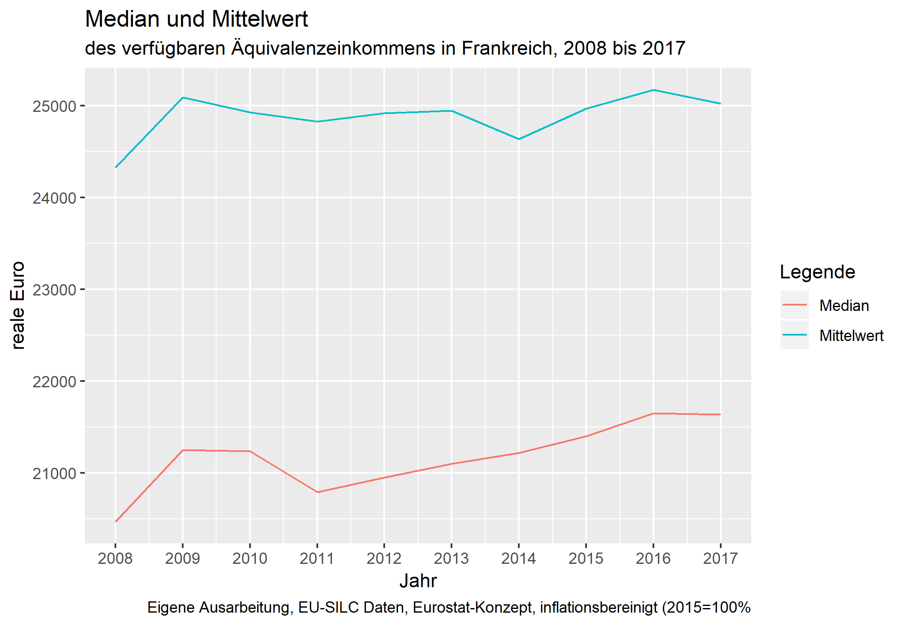
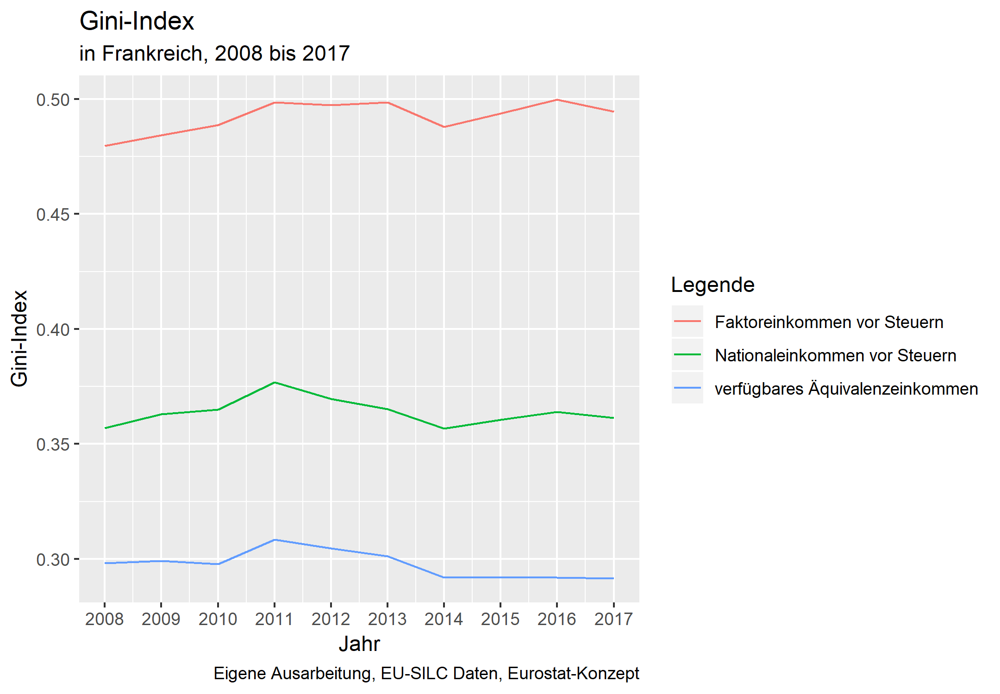
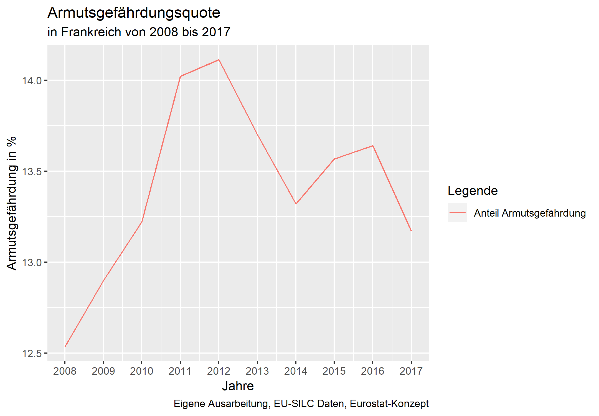
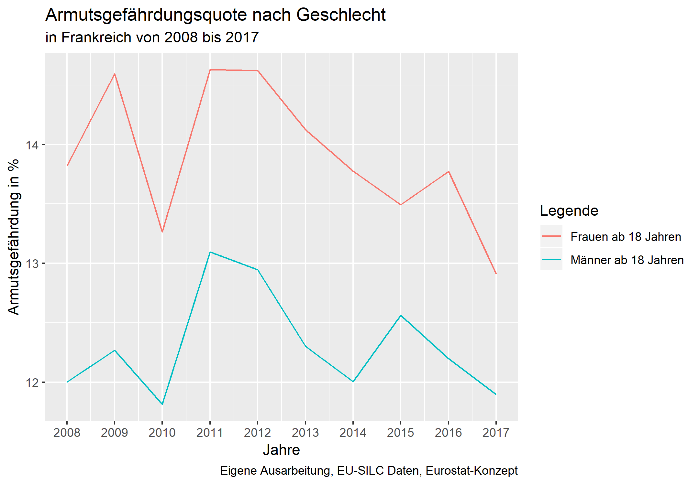
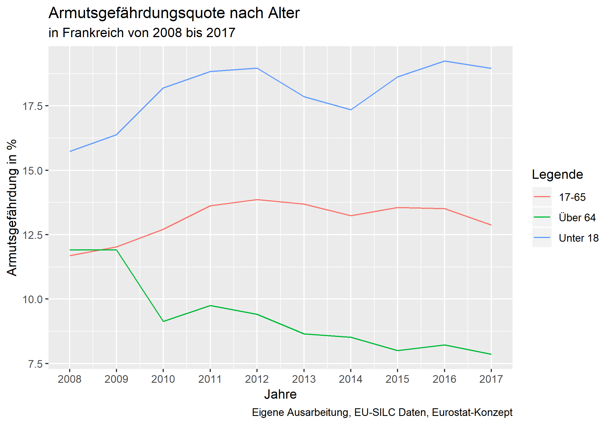

```{r setup, include=FALSE}
knitr::opts_chunk$set(echo = TRUE)
```
\newpage
 
# Einführung

## Einkommensverteilung in Frankreich
Fragen der Einkommensverteilung beschäftigen sich häufig mit sozialer Gerechtigkeit. Bereits seit mehreren Wochen häufen sich die Meldungen in den Medien über Proteste von Demonstranten, die durch steigende Spritpreis ausgelöst worden sind, sich jedoch bald in Proteste gegen soziale Ungleichheiten im Land gewandelt haben. Die Gründe für die Demonstrationen der sogenannten "Gelben Westen" sind unter anderem die soziale Ungleichheit, die bereits seit Längerem in Frankreich als problematisch gilt, aber auch die Politik von Präsident Macron. [@DeutscheZeitung] 
Der französische Präsident ist mehrfach unter Kritik geraten, politische Maßnahmen zu setzen von denen insbesondere die reichere Bevölkerungsschicht profitiert, wie zum Beispiel durch die weitgehende Abschaffung der Vermögenssteuer. [@povertystrategy2018financial]

Obwohl Frankreich als relativ egalitär bezeichnet werden kann und im internationalen Vergleich niedrige Werte in Bezug auf Einkommensungleichheits-Indikatoren aufweist, ist es auch in Frankreich zu einem Anstieg von Ungleichheiten gekommen. Neben Frankreich haben auch viele andere Länder, darunter Industrie- und Entwicklungssländer, einen starken Anstieg der Einkommensungleichheit gesehen. [@Pikettyblog]


## Armutsentwicklung in Frankreich
Armut ist von Einkommensungleichheit zu unterscheiden, da beide Konzepte doch sehr unterschiedliche Grundideen festhalten. 
[@Atkinson] Dennoch besteht eine direkte Verbindung zwischen Armut und Ungleichheit: Während Armut sich nur auf einen gewissen, nämlich den untersten Anteil der Verteilung beschränkt, beschreibt Einkommensungleichheit das ganze Ausmaß der Verteilung. 

Die länderübergreifende Analyse von Ländern mit mittleren und hohen Einkommen deuten auf eine starke Korrelation zwischen Armut und Einkommensungleichheit hin. Diese ist besonders stark wenn zur Messung relative Armutsindikatoren, wie etwa die Armutsgefährdungsquote, und bezüglich Einkommensungleichheit Maße wie die P90/P10 Ratio oder der Gini-Koeffizient, verwendet werden. Bei der langfristigen Betrachtung von Armutsindikatoren und Indikatoren die das Top Einkommen betreffen, wie unter anderem der Anteil der Top 10%, zeigt sich jedoch kein konsistenter Trend. [@Karagiannaki]

Mitte September 2018 verkündete der französische Präsident Emmanuel Macron Frankreichs Strategie gegen Armut. Acht Milliarden Euro sollen zur Verfügung gestellt werden, um Ungleichheiten zu verringern und die Armut innerhalb Frankreichs zu senken. [@povertystrategy2018financial] Besonderer Fokus liegt dabei auf der Förderung von jungen Menschen, deren Ausbildung von früh an unterstützt werden soll.Die Verringerung von Armut und sozialer Ausgrenzung gehört als wichtiger Parameter zur Strategie Europa 2020, die es zum Ziel hat Beschäftigung und Wachstum in der EU bis zum Ende dieses Jahrzehnts zu fördern. Für die fünf Bereiche Armut, Forschung und Entwicklung, Klimawandel und Energie, Beschäftigung und Bildung wurden Zielvorgaben entwickelt, die über die Laufzeit gemessen und überprüft werden. Bezüglich Armut und sozialer Ausgrenzung wurde eine Verringerung von zumindest 20 Millionen betroffenen Menschen anvisiert. [@europkommission]

# Literaturüberblick

##Entwicklung der Einkommensverteilung
Die längste Betrachtung der Einkommensverteilung in Frankreich wird über den Zeitraum von 1900-2014 mithilfe von Daten der Distributional National Accounts (DINA), welche National Accounts, Steuer- und  Umfragedaten vereint, von Garbinti, Goupille-Lebret und Piketty (2018) vorgenommen. Zu den relevanten Ergebnissen, welche die aktuelle Veränderung der Einkommensverteilung betrifft, gehört der relativ starke Anstieg der Top Einkommen seit den 1980er Jahren. Von 1983-2014 zeigt sich sowohl bei dem Arbeits- als auch dem Kapitaleinkommen ab dem 95. Perzentil ein  relativ starker  Anstieg,  der  bei  den  Top  1%  und  0,1%  am  größten  ist. Garbinti, Goupille-Lebret und Piketty (2018) zeigen auf, dass der Anteil am Gesamteinkommen der Top 1% von 1983 bis 2007 um mehr als 50% gestiegen ist, nämlich von weniger als 8% auf mehr als 12%. Während und nach der Wirtschafts- und Finanzkrise, zwischen 2008 und 2013, sinkt der Einkommensanteil der Top 10%, verbleibt jedoch auf einem höheren Niveau als zu Beginn der 1980er Jahre. Außerdem analysieren die Autoren die Entwicklung des Gender Pay Gap und kommen für das Jahr 2012 zu folgendem Ergebnis: Die Lohnunterschiede steigen mit zunehmendem Alter an. Mit 25 Jahren verdient ein Mann im Durchschnitt das 1.25-Fache von einer Frau. Im Alter von 65 Jahren, hat sich der Lohnunterschied deutlich vergrößert, da im Durchschnitt das Einkommen eines Mannes bei dem 1.64-Fachen einer Frau liegt. Geschlechtspezifische Lohnunterschiede bleiben somit groß, auch wenn diese in den letzten Jahrzehnten signifikant gesunken sind. [@Piketty2018]

Eine Erklärung für den Anstieg der Top Einkommen bis 2007 bietet der Bericht des Institutes for Public Policy (2014), welcher untersucht wie sich die Einkommenssteuer über hundert Jahre hinweg in Frankreich entwickelt hat. Seit 1987 haben sich mehrere Änderungen gezeigt: Bis 1986 gab es in Frankreich 14 verschiedene Einkommenssteuertarife, die sich auf 7 zwischen 1994 und 2006 und auf 6 ab 2013 reduziert haben. Die Folge davon war, dass sich auch der Grenzsteuersatzan der Spitze verringert hat: Zwischen 1994 und 2006 betrug er noch 56,8% und sunk im Jahr 2007 auf 40% ab. [@InstitutePolicy] Zu dem selben Schluss kommen auch Piketty, Saez, und Stantcheva (2014) die neben der Reduktion der Steuersätze auch die Abnahme des Einflusses von Gewerkschaften und Tarifverhandlungen, sowie die Rolle der Institutionen als Gründe für den Anstieg der Top Einkommen in Frankreich nennen.

Der Bericht der staatlichen französischen Statistikbehörde INSEE, der jedes Jahr erscheint und die Entwicklungen der Einkommens- und Vermögensverteilung zusammenfasst, kommt zum Ergebnis, dass die Einkommensungleichheiten von 2008 bis 2015 auf einem relativ stabilen Level geblieben sind. Der Gini-Koeffizient ist in dem Zeitraum leicht angestiegen, von 0,289 auf 0,292, sowie die 80/20 Ratio die von 4,3 auf 4,4 gestiegen ist. Die Publikation der staatlichen französischen Statistikbehörde basiert jedoch auf nationalen Daten, die nicht auf EU-Ebene harmonisiert sind, wie die EU-SILC Daten. [@INSEE]

## Rahmenbedingungen

Die Evolution der Einkommensverteilung kann auf diverse Faktoren zurückgeführt werden, wie etwa auf die gesamtwirtschaftliche Entwicklung, fiskal- und arbeitsmarktpolitische, demographische und institutionelle Faktoren. Piketty (2014) nennt im Falle Frankreichs etwa die Alterung der Bevölkerung, den Anstieg alleinerziehender Personen, und eine Rezession als Folge der Wirtschaftskrise [@Piketty2014]. Innerhalb von zwei Jahren brach das reale BIP-Wachstum um mehr als 5 Prozentpunkte ein, konkret von plus 2,34% in 2007 auf minus 2.9% in 2009. Nach zwei Jahren deutlichen Wachstums  stagnierte das BIP von 2012 bis 2014. In den Folgejahren zog das Wirtschaftswachstum wieder an und erreichte 2017 reale 2,2%. [@EurostatGDP]

Auf die Wirtschafts- und Finanzkrise reagierte Frankreich mit einem relativ starken Anstieg des Staatsausgabenanteils am BIP, schreiben Antoine Bozio et al (2015), die die Fiskalpolitik Frankreichs, Italiens, Großbritanniens und Spaniens von 2000 bis 2014 miteinander verglichen. Darauf folgte eine Haushaltskonsolidierung durch Steuererhöhungen. So wurden etwa 2012 die vorhandenen fünf Einkommenssteuerklassen um eine sechste Klasse erweitert. Der Grenzsteuersatz für Jahreseinkommen von mehr als 150.000€ wurde von 40% auf 45% angehoben; zusätzlich wurde ein Spitzensteuersatz von 75% für Jahreseinkommen ab einer Million beschlossen. Letzterer war allerdings bloß 2013 und 2014 in Kraft. [@Bozio2015]

Auf dem Arbeitsmarkt stieg die Beschäftigungsrate während und nach der Krise unter der älteren Bevölkerung weiter an; unter der jüngeren Bevölkerung hingegen sank sie. Diese Entwicklung wird gemeinhin auf die Erhöhung des Pensionsantrittsalters im Jahr 2010 zurückgeführt. [@Bozio2015] Konkret wurde das Pensionsantrittsalter von 60 auf 62 Jahre angehoben. In Verbindung mit einem rigiden Arbeitsmarkt, in dem arbeitsrechtliche Bestimmungen Lohnsenkungen und Kündigungen erschweren, wurden typischerweise ältere Arbeitnehmer geschützt. Stattdessen reagierten Arbeitgeber auf niedrige Produktivität und Inflation mit einem Aufnahmestopp, der den typischerweise jungen Arbeitssuchenden den Zugang zum Arbeitsmarkt erschwerte. [@Bozio2015]

Dies schlug sich auf die Entwicklung der Erwerbseinkommen nieder. Laut der Statistikbehörde Insee ist das Erwerbseinkommen in Frankreich von 2007 bis 2012 bloß um 0,2 Prozent gestiegen, verglichen mit jährlichen 0,6% von 2002 bis 2007. Dieser Rückgang ist primär auf den privaten Sektor zurückzuführen, denn im öffentlichen Sektor blieben die Erwerbseinkommen von 2002 bis 2012 weitgehend stabil. Während der Krise ging vor allem die Schere in den Erwerbseinkommen des Privatsektors zwischen jungen und älteren Beschäftigten auseinander. Während die Ungleichheit von 2002 bis 2007 über die gesamte Einkommensverteilung hinweg zurückgegangen war, trat von 2007 bis 2012 eine gegenteilige Entwicklung ein: In der unteren Hälfte der Einkommensverteilung stieg die Entfernung derjenigen mit dem niedrigsten Einkommen zu denjenigen in der Nähe des Medians signikfikant an. Die Entfernungen innerhalb der oberen 50% gingen hingegen zurück. [@Inseeportrait]

# Methodologie

## Daten
Um die Einkommensungleichheit und die Entwicklung von Armut in Frankreich im Zeitverlauf sichtbar zu machen, werden die Daten der EU-SILC (European Union Statistics on Income and Living Conditions) analysiert. Die Daten werden durch standardisierte jährliche Erhebungen innerhalb der EU zum Thema Einkommen und Lebensbedingungen erhoben, wodurch die Daten EU-weit vergleichbar sind. Dabei werden ausschließlich Personen befragt, die in Privathaushalten leben. Da der Schwerpunkt auf Einkommen liegt und detaillierte Daten vorhanden sind, bietet sich die Beurteilung der Einkommensverteilung und sozialen Eingliederung in Frankreich durch EU-SILC Daten an.[@EurostatEUSILC]

Trotz der EU-weiten Harmonisierung der Datenerhebung treten weiterhin länderspezifischen Unterschiede auf. So wird etwa das Sacheinkommen durch die Bereitstellung von Dienstwägen grundsätzlich separat erhoben und folglich separat in die Einkommensaggregate eingerechnet. In Frankreich ist dies aus technischen Gründen allerdings nicht möglich, sodass etwaige Sacheinkommen durch Dienstwägen bereits in der Variable des Bruttojahreseinkommen (PY010G) enthalten ist. Dies soll im Sinne der Nachvollziehbarkeit erwähnt werden, hat auf die vorliegende Analyse jedoch keine Auswirkungen. [@EurostatQualityReport]


## Konzepte
Zur Analyse der Einkommensverteilung in Frankreich werden drei verschiedene Einkommensaggregate herangezogen, die nun näher erläutert werden. Das Faktoreinkommen vor Steuern entspricht der Summe aller Erwerbs- und Kapitaleinkommen eines Jahres. Dieses Konzept klammert also das Steuer- und Sozialversicherungssystem eines Landes aus, was nützlich sein kann, um etwa die Verteilung von Löhnen innerhalb der Erwerbsbevölkerung zu begutachten. 
Problematisch am Faktoreinkommen ist jedoch, dass pensionierte Personen typischerweise über ein sehr kleines bzw. über gar kein Faktoreinkommen verfügen. Steigt also der Anteil älterer Personen an der Gesamtbevölkerung eines Landes, werden dessen Ungleichheitsmaße auf Basis des Faktoreinkommens automatisch größer. Dieser Umstand kann Vergleiche über Jahre bzw. Staaten hinweg verzerren. [@Piketty2018]

Das Nationaleinkommen vor Steuern entspricht dem Faktoreinkommen zuzüglich Arbeitslosenbezüge und Pensionszahlungen. Andere Transfer- und Steuerzahlungen bleiben aber weiterhin unberücksichtigt. Durch das Einbeziehen von arbeitsbezogenen Transfers wird die beim Faktoreinkommen auftretende Verzerrung durch veränderte Altersstrukturen umgangen. Allerdings wird das Nationaleinkommen vor Steuern naturgemäß durch Reformen im Bereich der Arbeitslosen- und Pensionsversicherung verzerrt. Das kann aber durchaus einen gewünschten Effekt darstellen und durch einen Vergleich mit dem Faktoreinkommen vor Steuern erkenntlich gemacht werden.

Das verfügbare Einkommen nach Steuern entspricht dem Nationaleinkommen vor Steuern, zuzüglich aller weiteren monetären Transfers und abzüglich aller direkten Steuern. Dieses Konzept ist von allen drei vorgestellten Aggregaten zur Messung der Armutsgefährdungsquote am besten geeignet, da insbesondere Personen am unteren Ende der Einkommensverteilung auf staatliche Transfers angewiesen sind, die im Zuge der beiden Vorsteuer-Aggregate nicht vollständig berücksichtigt werden. Die Verteilung des verfügbaren Einkommens wird daher im Fokus dieser Arbeit stehen. Wertvolle Einblicke kann zudem eine Gegenüberstellung des verfügbaren Einkommens mit den Vorsteuer-Aggregaten liefern, da sie das Ausmaß der Umverteilung durch den Staat wiedergibt.

Da einige Einkommensdaten wie etwa Mieteinnahmen und Kapitalerträge nur auf Haushaltsebene verfügbar sind, müssen zudem Annahmen zur Aufspaltung von Haushalts- in Personeneinkommen getroffen werden. Hierfür werden zwei Konzepte angewandt: In Anlehnung an Eurostat werden alle befragten Personen jeden Alters in das Sample aufgenommen. Dann werden alle Einkommen eines Haushalts addiert und gleichmäßig auf die äquivalenten Haushaltsmitglieder aufgeteilt. Es wird also angenommen, dass alle Haushaltsmitglieder in gleichem Maße vom Haushaltseinkommen zehren. Zudem impliziert der herangezogene Äquivalenzschlüssel, dass Haushalte gewisse Größenvorteile haben. [@Eurostatmethod]

Als zweites Konzept werden in Anlehnung an die World Inequality Database bloß Personen ab einem Alter von 20 Jahren in das Sample aufgenommen. Dann wird nicht das gesamte Haushaltseinkommen gepoolt, sondern bloß jener Anteil, der ausschließlich auf Haushaltsebene verfügbar ist. Dieser Anteil wird dann auf die reale Anzahl an Haushaltsmitgliedern aufgeteilt und zum persönlichen Einkommen, wie etwa Erwerbseinkommen, hinzugezählt. Es werden also keine Größenvorteile von Haushalten impliziert. Zudem handelt es sich um ein individualistisches Einkommenskonzept, das auf der Annahme basiert, dass etwa eine nicht erwerbstätige Frau in einem geringeren Ausmaß vom Gehalt ihres Mannes profitiert als dieser selbst. Angesichts der niedrigeren Erwerbsquote von Frauen und des Gender Wage Gap kann diese Methode also zum Beispiel zur Analyse von Geschlechterunterschieden nützlich sein. Allerdings wird durch das restriktivere Sample die finanzielle Belastung durch im Haushalt lebende Kinder vollständig ausgeklammert.

Zum Prozess der Datenaufbereitung soll angemerkt werden, dass alle Personen, die kein Einkommen oder ein negatives Einkommen in einer der drei Einkommenskonzepte aufweisen, vor der Berechnung aller Indikatoren aus dem Sample genommen werden. Damit wird gewährleistet, dass alle Indikatoren, auch etwa das Quintilsverhältnis, problemlos berechnet werden können und dass alle Indikatoren aller dreier Einkommensaggregate auf der gleichen Anzahl an Beobachtungen basieren. Unterschiede in der Anzahl an Beobachtungen treten somit nur zwischen dem Eurostat- und WID-Konzept auf, da letzteres auf Personen ab einem Alter von 20 Jahren eingeschränkt ist. Der Vorteil an dieser Vorgehensweise ist, dass die Indikatoren besser zueinander in Bezug gesetzt werden können. Der Nachteil ist jedoch, dass jene Personen, die etwa aufgrund von Pensionierung oder Arbeitslosigkeit kein Faktoreinkommen vor Steuern beziehen, aus dem Sample ausgeschlossen werden - das gilt auch für die Analyse auf Basis des Nationaleinkommens vor Steuern und des verfügbaren Einkommens.

Die berechneten Indikatoren für die Periode von 2004 bis 2008 werden (vorerst) nicht ausgewiesen und diskutiert, da sie große Sprünge aufweisen. Diese Sprünge wirken unplausibel - es wird vermutet, dass sie aus Zeitreihenbrüchen in den Definitionen der von Eurostat bereitgestellten Daten resultieren. Auch etwaige Anpassungen der Personen- oder Haushaltsgewichte könnte dazu beigetragen haben, dass die berechneten Indikatoren nicht über den gesamten analysierten Zeitraum vergleichbar zu sein scheinen.


# Ergebnisse

## Einkommensverteilung in Frankreich

#### Median und Mittelwert

Die Zeitreihen für das Median- und Mittelwerteinkommen wurden mit dem Verbraucherpreisindex der Eurostat bereinigt. Dadurch wurden alle Einkommen in das Preisniveau von 2015 konvertiert. 
Klar ersichtlich ist, dass sowohl das Durchschnitts- als auch das Medianeinkommen in Frankreich von 2007 bis 2017 angestiegen ist. So stieg das mittlere Jahreseinkommen eines äquivalenten Haushaltsmitglieds von 2007 bis 2017 von rund 18.7750€ auf 22.020€ an. Das Durchschnittseinkommen stieg noch stärker an und liegt zudem deutlich über dem Medianeinkommen, was bedeutet, dass eine rechtsschiefe Einkommensverteilung vorliegt. Auch ist der relative Unterschied zwischen Mittelwert und Median des verfügbaren Einkommens über den untersuchten Zeitraum hinweg gewachsen: 2007 lag der Mittelwert noch 12,03 % über dem Median, 2017 waren es 16,1 %. Geeignetere Indikatoren für das Ausmaß der Ungleichheit der Einkommensverteilung, die nachfolgend untersucht werden.

Auffallend ist, dass das Medianeinkommen von 2009 bis 2012 fiel, während in den verbleibenden untersuchten Perioden stets ein (zumindest kleiner) Zuwachs zu verzeichnen war. Diese Einbußen können mit der Wirtschafts- und Finanzkrise 2008 in Bezug gesetzt werden, im Zuge derer Frankreichs Volkswirtschaft in eine Rezession geriet (siehe Literaturüberblick). Es liegt nahe, dass sich diese Entwicklung auch auf die Einkommen privater Haushalte negativ auswirkte. [@EurostatGDP]

{width=90%}

#### Gini-Koeffizient

Der Gini-Index misst, wie weit die Einkommensverteilung eines Landes von einer perfekt gleichen Verteilung abweicht. Er kann grundsätzlich Werte zwischen 0 und 1 annehmen, wobei 0 eine vollkommen gleiche Verteilung wiedergibt; 1 eine vollkommen ungleiche Verteilung. Nicht zuletzt aufgrund seiner internationalen Verfügbarkeit und einfachen Interpretation ist der Gini-Index der am häufigsten angewendete Indikator zur Messung von Ungleichheit in Einkommensverteilungen. Nachteil des Gini-Index ist, dass er auf Veränderungen in der Mitte der Verteilung deutlich stärker reagiert als auf Veränderungen an den Rändern der Verteilung [@Gastwirth2017]. Aus diesem Grund wird er in dieser Arbeit bloß komplementär zu weiteren Ungleichheitsinidikatoren herangezogen.

Im nachfolgenden Graphen ist die Entwicklung der Gini-Indizes der drei Einkommensaggregate von 2007 bis 2017 abgebildet. Der Gini-Index für das verfügbare Einkommen ist von 2007 bis 2017 von 0,26 auf 0,28 angestiegen; der größte Sprung erfolgte allerdings von 2007 auf 2008 – seitdem ist er weitgehend stabil. Der Gini-Index des Faktoreinkommens vor Steuern ist von 2008 bis 2017 leicht angestiegen und liegt deutlich über den Gini-Indizes der anderen beiden Einkommensaggreate, was aus der Umverteilungswirkung staatlicher Institutionen resultiert. Für alle Einkommenskonzepte befindet sich der Index im Jahr 2007, also in Vorkrisenzeiten, auf dem niedrigsten Niveau des gesamten Betrachtungszeitraumes. Ein deutlicher Peak ist im Jahr 2011 zu erkennen, im gleichen Jahr also, in dem das Medianeinkommen deutlich sank. Dieser Peak fällt für das verfügbare Einkommen allerdings deutlich schwächer aus als für das Nationaleinkommen vor Steuern, was sich durch die verteilungswirkung staatlicher Transfers und progressiver Besteuerung erklären lässt. 


{width=90%}

#### S80/S20

Das S80/S20 Quintilverhältnis (QV) gibt an, um welchen Faktor man das Einkommen der ärmsten 20 Prozent der Bevölkerung multiplizieren muss, um das Einkommen der reichsten 20% zu erhalten. Der Fokus dieses Indikators liegt also, im Kontrast zum Gini-Koeffizienten, auf den beiden äußeren Rändern der Einkommensverteilung. [@Eurostats80]

Über die untersuchte Dekade ist das QV sowohl für das Nationaleinkommen vor Steuern als auch für das verfügbare Einkommen angestiegen: 2007 hatten die reichsten 20% über 6,3 mal so viel Nationaleinkommen vor Steuern als die ärmsten 20%, aber nur 3,7 mal so viel verfügbares Einkommen. Im Jahr 2017 beträgt der Indikator 6,5 bzw. 4,1. Auffallend ist ein Peak im Jahr 2011, der auch mit einem sinkenden Medianeinkommen und einem steigenden Gini-Index einherging. Seitdem ist das QV für beide Aggregate jedoch kontinuierlich gesunken. 

Die 2012 in Kraft getretene Steuerreform, im Zuge derer der Grenzsteuersatz für Einkommen über 250.000€ auf 45% erhöht wurde, hatte keinen sichtbaren unmittelbaren Effekt auf das QV des verfügbaren Einkommens. Auch der 2013 und 2014 vorhandene Grenzsteuersatz für Jahrenseinkommen von mehr als einer Million schlägt sich auf den ersten Blick nicht nieder. Möglich ist aber, dass als Reaktion auf die Steuereform schlichtweg weniger Einkommen deklariert wurde. Allerdings machen die von diesen Reformen betroffenen Personen bloß einen kleinen Anteil an den Top 20% aus. Hinzu kommt, dass die Datenerhebung für EU-SILC auf freiwilliger Basis erfolgt. Dadurch unterliegt die Hochrechnung insbesondere am oberen Rand einer großen Schwankungsbreite.

{width=90%}


#### Anteil der Top 10%

Dieser Einkommensindikator beschreibt jenen Anteil, den die reichsten 10% der französischen Bevölkerung, gemessen am Gesamteinkommen verdienen. Um den Anteil der Top 10% darzustellen, werden die drei verschiedenen Einkommenskonzepte verwendet: das Faktoreinkommen, Nationaleinkommen (beide vor Steuern) und das verfügbare Einkommen (nach Steuern). Das gesamte Einkommen wird innerhalb eines Haushalts über alle Mitglieder gleich verteilt (Eurostat-Konzept). Unabhängig vom Einkommenskonzept zeigt sich über den gesamten Betrachtungszeitraum ein Anstieg des Anteils der Top 10% und den höchsten Wert weist durchgehend das Faktoreinkommen auf. Der höchste Zuwachs wird zu Beginn der Periode, im Besonderen im Jahr 2007, verzeichnet. Seit den 1980er Jahren wurden in Frankreich mehrfach Steuerreformen durchgeführt, welche die vierzehn Tarifstufen auf sieben reduziert haben. Dazu zählen jene die den höchsten Steuersatz im Jahr 2006 auf 48,09% und 2007 auf 40% herabgesetzt hat und 2012 wieder auf 45% erhöht hat. [@InstitutePolicy]

{width=90%}

Garbinti, Goupille-Lebret und Piketty (2018) führen das Ansteigen der Top Einkommen, welches seit den 1980er Jahren begonnen hat auf folgende Effekte zurück: ökonomische und institutionelle Faktoren wie die sinkende Einflussnahme von Gewerkschaften, sowie die Zunahme der Vermögenskonzentration. Diese Faktoren sollen die Entwicklung der Top Einkommen, jene ab dem 95.Perzentil, maßgeblich beeinflusst haben. Zwischen 2008 und bis 2012 soll der Anteil der Top 10% jedoch auf relativ konstantem Level geblieben sein. [@Piketty2018] 

Laut der der mithilfe von SILC-Daten errechneten Einkommenskonzepten zeigt sich jedoch ein anderes Bild, der Anteil der Top 10% steigt kontinuierlich von 2005 bis 2017 an. Während ein gewisser Anstieg durch die oben beschrieben Änderungen begründet werden kann, lässt sich nicht das gesamte Ausmaß und die Dauer des Anstiegs erklären. Ein möglicher Grund dafür könnte durch die Veränderung von Variablen, die zur Berechnung der Einkommen verwendet wurden, enstanden sein.


## Armutsentwicklung in Frankreich
Laut der Europäischen Kommission war im Jahr 2016 23,5% der Bevölkerung der Europäischen Union und somit beinahe jede vierte Person von Armut und sozialer Ausgrenzung in der EU bedroht. Dabei wird Armut und soziale Ausgrenzung nicht nur monetär, sondern als ein multi-dimensionales Konstrukt beschrieben. Es werden im Besonderen drei verschiedene Formen beschrieben, die neben monetärer Armut auch noch den Grad der materiellen Deprivation sowie die Arbeitsintensität des Haushalts umfassen. Innerhalb der EU kommt die monetäre Armut im Jahr 2016 am häufigsten vor und betrifft 17,3% der Bevölkerung der Europäischen Union. Erhebliche materielle Deprivation dahingegend erfährt nur ein geringerer Anteil von 7,5%, und 10,5% weisen eine niedrige Arbeitsintensität auf. Die Quote der materiellen Deprivation ist verglichen zur Armutsgefährdungsquote und der niedrigen Arbeitsintensität EU-weit gefallen, und weist somit die größte Veränderung auf. Seit dem Jahr 2010 ist der Anteil der niedrigen Arbeitsintensität auf einem relativ konstanten Level geblieben. Dieser umfasst Personen, die im Alter von 0 bis 59 Jahre eine geringere Arbeitsintensität aufweisen. Eine Vollzeit Anstellung zu haben heißt jedoch nicht in jedem Fall, von Armut und sozialer Ausgrenzung verschont zu bleiben: Innerhalb der EU galten 2016 7,8% trotz Vollzeitbeschäftigung als armutgefährdet. Im Vergleich zur OECD und somit anderen Industriestaaten, ist die monetäre Armut im Durchschnitt in den EU-Länder mit 17,3% relativ gering, während sich dieser Wert auf OECD-Ebene zwischen 20% und 25% bewegt. [@Eurostatindicator]

Um das Ausmaß und die Entwicklung der Armut und sozialen Ausgrenzung innerhalb von Frankreich zu beurteilen, werden die zwei folgenden Hauptindikatoren verwendet: die Armutsgefährdungsquote und die Quote der materiellen Deprivation. Dabei wird im Folgenden eine Zeitreihenanalyse beginnend im Jahr 2007 bis 2017 durchgeführt und die Entwicklung sowie etwaige Veränderungen erforscht. Diese Messgrößen stellen jedoch nicht den Anspruch, die Armutsschichten in Frankreich vollständig darzustellen, da dafür eine umfangreichere Analyse notwendig wäre. Dennoch stellen die beiden Indikatoren eine Teil jener EU-Sozialindikatoren dar, anhand von welchen die Erreichung der Strategie Europa 2020 betreffend Armut und sozialer Ausgrenzung gemessen wird.

#### Armutsgefährdungsquote

Die Armutsgefährdungsquote beschreibt den Anteil der Personen, die aufgrund ihres relativ geringen Einkommens von Armut und sozialer Ausgrenzung bedroht sind. Der Indikator stellt ein monetäres und relatives Maß zur Messung von Armut dar und weist häufig, aber nicht zwingend, auf einen niedrigen Lebensstandard hin. Die Messgröße für die Armutsgefährdungsquote ist das verfügbare Äquivalenzeinkommen einer Person. Dies entspricht jenem Einkommen des Haushaltseinkommens (nach Steuern und anderen Abgaben), welches durch die einzelnen Haushaltsmitglieder aufgeteilt und gewichtet wird, und somit jeder einzelnen Person des Haushalts zur Verfügung steht. Sobald das Äquivalenzeinkommen den Schwellenwert, der üblicherweise mit 60% des Medianeinkommens festgesetzt ist, unterschreitet, wird Armutsgefährdung vermutet. Die Armutsgefährdungsquote ist somit der Anteil der Personen, deren verfügbares Äquivalenzeinkommen weniger als 60% des nationalen mittleren Einkommens ausmacht. [@Eurostatriskpoverty] Somit drückt die Armutsgefährdungsquote nur das Ausmaß der Armut aus, aber nicht die Intensität, da nicht berücksichtigt wird, wie weit die jeweilige Personen vom Schwellenwert entfernt ist. Veränderungen wie etwa steigende Lebenserhaltungskosten werden bei der Berechnung der Armutsgefährdungsquote im Zeitverlauf nicht berücksichtigt. 

In Folgenden wird die Armutsgefährdungsqote für die gesamte Französische Bevölkerung, nach Geschlecht und nach Alter aufgeschlüsselt. 

|             |Gesamt | Frauen | Männer| <18   | 17-64  | >64   |
| ---         | ----- | ------ | ----- | ----- | ------ | ----- |
| 2007        | 13,1  | 14,0   | 12,8  | 14,9  | 12,5   | 13,1  |
| 2008        | 12,5  | 13,8   | 12,0  | 15,7  | 11,7   | 11,9  |
| 2009        | 12,9  | 14,6   | 12,3  | 16,4  | 12,0   | 11,9  |
| 2010        | 13.2  | 13,3   | 11,8  | 18,1  | 12,7   | 9,1   |
| 2011        | 14,0  | 14,6   | 13,1  | 18,8  | 13,6   | 9,7   |
| 2012        | 14,1  | 14,6   | 12,9  | 19,0  | 13,9   | 9,4   |
| 2013        | 13,7  | 14,1   | 12,3  | 17,9  | 13,7   | 8,7   |
| 2014        | 13,3  | 13,8   | 12,0  | 17,3  | 13,3   | 8,5   |
| 2015        | 13,6  | 13,5   | 12,6  | 18,6  | 13,6   | 8,0   |
| 2016        | 13,6  | 13,8   | 12,2  | 19.2  | 13,5   | 8,2   |
| 2017        | 13,2  | 12,9   | 11,9  | 19,0  | 12,9   | 7,9   |

In Frankreich gelten 12,3% der Bevölkerung laut der Armutsgefährdungsquote als armutsgefährdet. Dies entspricht dem gleichen Anteil der Bevölkerung wie zu Beginn des Betrachtungszeitraumes. Die Armutsgefährdungsquote umfasst alle Personen der Bevölkerung Frankreichs, die in Privathaushalten leben. Die Armutsgefährdungsquote zeigt über den Beobachtungszeitraum als bemerkenswerteste Veränderung den Anstieg zwischen 2010 und 2012 von rund 1,3% auf. Im Jahr 2012 wird der höchste Wert der Armutsgefährdungsquote von etwa 13,6% erreicht, welcher dann wieder auf 12,6% im Jahr 2015 absinkt. Der Anstieg der Armutsgefährdungsquote geht laut der staatlichen französischen Statistikbehörde auf die Wirtschafts- und Finanzkrise 2008/2009 zurück und sinkt seitdem wieder ab.

{width=90%}

Die Aufspaltung der Armutsgefährdungsquote nach Geschlecht ermöglicht die Analyse ob Männer oder Frauen im Durchschnitt mehr von Armut bedroht sind. Dabei werden nur Personen die 18 Jahre alt sind berücksichtigt. Unabhängig davon, ob das gesamte Einkommen (Eurostat-Konzept) oder nur das Haushaltseinkommen (WID-Konzept) auf dessen Mitglieder aufgeteilt werden, zeigt sich bezüglich der Richtung, aber auch des Ausmaßes ein konsistentes Bild: Im Durchschnitt liegt das verfügbare Äquivalenzeinkommen von Frauen häufiger unter dem Schwellenwert (60% des Medianeinkommens) als jenes der Männer. Damit sind Frauen durchschnittlich stärker von Armut bedroht: Im Jahr 2007 waren 12,9% der Frauen und 11,9% der Männer in Frankreich armutsgefährdet. Der stärkste Anstieg der Armutsgefährdungsquote zeigt sich von 2008-2012 und betrifft 14,2% der Frauen und 12,5% der Männer (2012). Dies könnte darauf hinweisen, dass von dem Anstieg der gesamten Armutsgefährdungsquote von 2008-2012 mehr Frauen betroffen waren. Bis 2017 sinkt der Anteil der Personen die von Armut gefährdet sind wieder ab und erreicht den Wert 12,1% für Männer und 12,7% für Frauen.


{width=90%}

Außerdem kann die Armutsgefährdungsquote nach unterschiedlichen Altersschichten aufgeschlüsselt werden. Die untenstehende Abbildung zeigt die Armutsgefährdungsquote über den Betrachtungszeitraum von 2007 bis 2017 drei unterschiedliche Altersgruppen: unter 18, zwischen 17-64 und älter als 64 Jahre.


{width=90%}

Dabei lässt sich erkennen, dass die Armutsgefährdungsquote der ältesten Altersgruppe über den gesamten Betrachtungszeitraum absinkt und ab 2009 kontinuierlich unter den anderen beiden liegt. Damit ist die Bedrohung durch Armut für Personen in Frankreich ab 65 Jahre am niedrigsten. Die jüngste Altersschicht hingegen ist in allen Jahren die Schicht, welche die größte Armutsgefährdung aufweist. Im Mittelfeld befinden sich unter 18-64 jährigen nimmt über den Beobachtungszeitraum kontinuierlich zu und stellt im letzten Jahr die Gruppe dar, die am meisten von Armut bedroht ist.

#### Erhebliche materielle Deprivation

Die Quote der erheblichen materiellen Deprivation ist ein absolutes Maß der Armut und beschreibt jenen Anteil der Personen, die aufgrund von mangelnden Resourcen mit materiellen Entbehrungen leben müssen. Dabei wird bewusst unterschieden, ob sich eine Person gewisse Einheiten nicht leisten will oder kann. Um eine verlässliche Messung der materiellen Deprivation zu ermöglichen, wird ein Index zusammengestellt, der insgesamt aus neun Elementen besteht. Schwere materielle Entbehrung liegt dann vor, wenn sich eine Person vier von neun ausgewählten Elemente nicht leisten kann. Diese umfassen unter anderem ob sich eine Person eine Waschmaschine leisten kann, mehrfach in Zahlungsrückstand (Miete, Strom, Kreditkarte) geraten ist und die Fähigkeit, die Wohnung ausreichend warm halten zu können. Somit werden Dimensionen berücksichtigt die für das Leben notwendig sind und einen gewissen Mindeststandard ermöglichen. [@Eurostatindicator]

Die untenstehende Tabelle zeigt die Quote der schweren materiellen Deprivation (SMD) über die Zeitreihe von 2011-2017.

|Jahr         | 2011  | 2012   | 2013  | 2014   | 2015   | 2016   | 2017   |
| ---         | ----- | ------ | ----- | ------ | -----  | ------ | -----  |
| SMD         | 4,5   | 4,5    | 4,5   | 4,4    | 4,5    | 4,0    | 3,5    |


Diese neun Elemente werden auf Haushaltsebene abgefragt und anschließend den einzelnen Personen des Haushalts zugeordnet. Im Jahr 2011 waren 4,5% der Bevölkerung in Frankreich von erheblicher materieller Deprivation betroffen. Seit diesem Zeitpunkt lässt sich bis 2017 aufgrund des mithilfe von EU-SILC Daten errechneten Indexes ein Absinken auf 3,5% feststellen. 

Der Indikator wird erst ab 2011 untersucht, da es ab dann zu einem Zeitreihenbruch von einer der neun Variablen gekommen ist, nämlich jener die den Zahlungsrückstand (hs010 bzw. hs011) betrifft. Die Variable und deren Definition wurde 2011 geändert: Vor der Änderung wurde nur berücksichtigt, wenn jemals ein Zahlungsrückstand betreffend Miete, Gas, Strom und Kreditkarte entstanden ist. Ab 2011 wurde unterteilt, wie oft ein Rückstand entstanden ist und nur als materielle Deprivation gezählt, wenn dieser zwei Mal oder öfter zustande gekommen ist. Vor dem Zeitreihenbruch besteht die Variable in mehreren Jahren ausschließlich aus fehlenden Werten, weswegen der Indikator erst ab 2011 betrachtet wird. Ab dann verbleibt doch rund ein Viertel bis ein Drittel der Werte von hs011 pro Jahr die nicht verfügbar sind.

Beide Armutsindikatoren, die Quote der materiellen Deprivation sowie die Armutsgefährdungsquote, schaffen es jedoch nur ein beschränktes Ausmaß der verschiedenen Armutslagen darzustellen. Um die Vielschichtigkeit von Armut besser darstellen zu können, würde es sich für eine umfangreichere Analyse noch empfehlen weitere Indikatoren zu betrachten. 

# Zusammenfassung

Die Einkommensverteilung in Frankreich wird mithilfe von verschiedenen Indikatoren über die Zeitreihe von 2007 bis 2017 analysiert. Dabei wird der Median, der Mittelwert, der Gini-Index, der Anteil der Top 10% und das S80/S20 Einkommensquintilverhältnis untersucht. Seit 2007 lässt sich ein durchgehender Anstieg bezüglich des mittleren aber auch des Durchschnittseinkommens beobachten. Das Durchschnittseinkommen ist über den Beobachtungszeitraum stärker angestiegen und liegt deutlich über dem Medianeinkommen, welches für eine rechtsschiefe Verteilung spricht. Der Mittelwert war 2007 noch um 12,03% höher als der Median, im Jahr 2017 betrug der Unterschied bereits 16,1%. Die Betrachtung des Gini-Koeffizientens für alle drei Einkommenskonzepte zeigt den niedrigsten Wert im Jahr 2007. Der Gini-Index des Faktoreinkommens vor Steuern zeigt einen leichten Anstieg von 2007 bis 2017 und liegt deutlich über den Gini-Indizes der anderen beiden Einkommensaggregaten, was für Umverteilungseffekte durch staatliche Institutionen spricht. 2011 wird der höchste Wert des Gini-Koeffizienten über den gesamten Betrachtungszeitraumes hinwe erreicht, was mit einem deutlichen Rückgang des Medianeinkommens in Verbindung steht. Auch das S80/S20 Einkommensquintilverhältnis zeigt einen leichten Anstieg in der Einkommensverteilung über die untersuchte Dekade an. Das QV ist sowohl für das Nationaleinkommen vor Steuern als auch für das verfügbare Einkommen angestiegen: 2007 hatten die reichsten 20% über 6,3 mal so viel Nationaleinkommen vor Steuern als die ärmsten 20%, aber nur 3,7 mal so viel verfügbares Einkommen. Im Jahr 2017 beträgt der Indikator 6,5 bzw. 4,1. Dabei fällt besonders der Peak im Jahr 2011 auf, der auch mit einem sinkenden Medianeinkommen und einem steigenden Gini-Index einherging. Dies lässt sich durch die Folgen der Wirtschafts- und Finanzkrise erklären.

Für den Anteil, den die Top 10% am Gesamteinkommen verdienen, lässt sich über die gesamte Zeitreihe (2007 bis 2017) ein deutlicher Anstieg beobachten. Dies ist unabhängig davon, welches der drei Einkommenskonzepte verwendet wird. Naheliegende Gründe für den Anstieg sind einerseits die Senkung des Spitzensteuersatzes und der positive Effekt einer höheren Vermögenskonzentration auf die Kapitaleinkommen. Aber auch weitere ökonomische und institutionelle Faktoren, wie etwa die sinkende Einflussnahme von Gewerkschaften könnte dieser Entwicklung zugrudliegen. Zusammenfassend lässt sich aufgrund aller vier Verteilungsindikatoren ein Anstieg der Einkommensungleichheit in Frankreich konstatieren.

Zur Beurteilung der Entwicklung von Armut und sozialen Ausgrenzung innerhalb Frankreichs wurde die Armutsgefährdungsquote und die Quote der materiellen Deprivation über den Betrachtungszeitraum von 2007 bis 2017 untersucht. Gemessen am erstgenannten Indikator waren im Jahr 2017 rund 12,3% der Bevölkerung in Frankreich von Armut bedroht. Während der Wirtschafts- und Finanzkrise und der nachfolgenden Rezession stieg die Armutsgefährdungsquote bis 2012 auf 13,6% an. Anschließend sank der Indikator wieder und erreichte das gleiche Niveau wie zu Beginn des Betrachtungszeitraumes. Die Aufspaltung nach Geschlecht zeigt, dass die Armutsgefährdungsquote von Frauen kontinuierlich über jener der Männer liegt und damit das Armutsrisiko über die gesamte Zeitreihe für Frauen im Durchschnitt höher ist. Außerdem lassen die Ergebnisse den Schluss zu, dass von dem bemerkenswerten Anstieg der gesamten Armutsgefährdungsquote von 2010 bis 2012 mehr Frauen als Männer betroffen waren. Armut in Form von erheblicher materieller Entbehrung zeigt jedoch ein anderes Bild als die Armutsgefährdungsquote: Über den untersuchten Beobachtungszeitraum sinkt die Quote der materiellen Deprivation kontinuierlich ab und erreicht 2017 ein deutlich niedrigeres Level als zu Beginn.

\newpage

# Literatur

<!-- Leer lassen -->